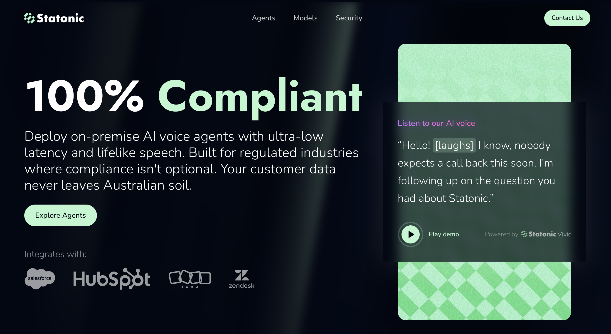
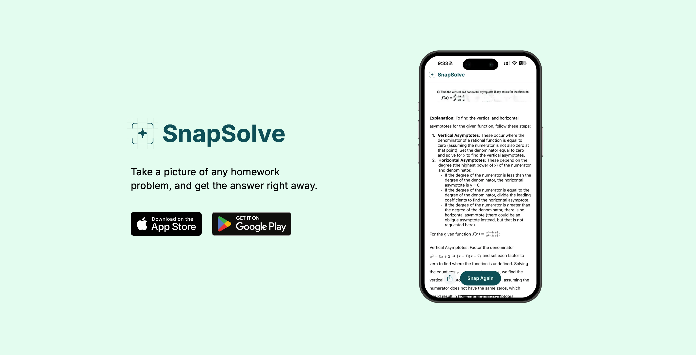
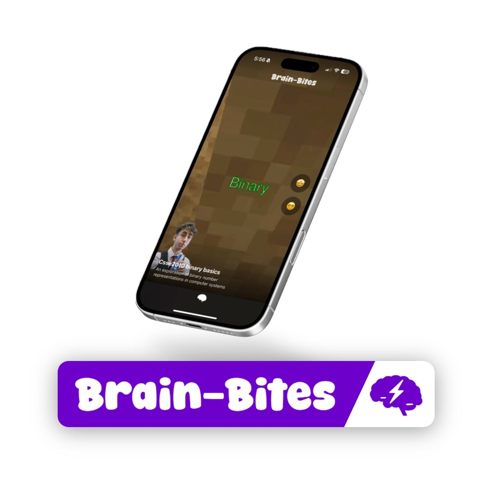
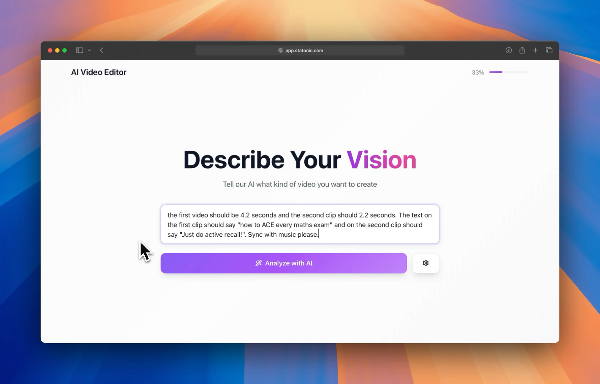

# Projects

<h3>Statonic</h3>

AI
Machine Learning
Web Dev
Cloud Infrastructure

Australia's first sovereign voice AI platform. Zero-PII architecture processes everything on Australian infrastructure—on-premise or private cloud. Natural voice conversations with real-time responsiveness, built for regulated industries without the compliance headache.

<a href="https://statonic.com" target="_blank">Live Site</a>
<a href="https://www.linkedin.com/posts/statonic_australian-voices-australian-servers-activity-7402220030916239360-reHd" target="_blank">Demo</a>

<h3>SnapSolve</h3>

Mobile
EdTech
Design

EdTech mobile app with 40,000+ monthly users at peak. Snap a photo of any math problem and get step-by-step solutions. Led design and conversion flow optimization to increase revenue.

<a href="https://snapsolve.ai" target="_blank">Live Site</a>

<h3>Brain-Bites</h3>

Mobile
Cloud Infrastructure
AI

AI pipeline that automatically transforms course PDFs into TikTok-style learning videos. End-to-end automation from document parsing to video generation. Built in under 48 hours.

UQ Computing Society Hackathon — 1st Place

<a href="https://github.com/s4raaga/brain-bites" target="_blank">GitHub</a>

<h3>AI Video Editor</h3>

AI
Video
Web Dev

Natural language video editor that understands plain English instructions. Auto-detects clip references, syncs music to drops, optimizes text positioning and timing. Built to rapidly generate content at scale.

<a href="https://github.com/dnldsz/auto_video_editor" target="_blank">GitHub</a>
<a href="https://www.linkedin.com/posts/d-souza-daniel_i-hate-editing-videos-this-year-alone-activity-7349737449968857089-MA9q" target="_blank">Demo</a>

